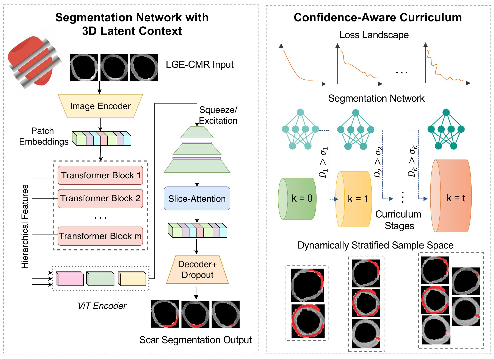

# CalcSeg: Confidence-aware 3D Latent Context Curriculum Learning For Myocardial Scar Segmentation From Single-Stack LGE-CMRs
This is the official repository for the paper "CalcSeg: Confidence-aware 3D Latent Context Curriculum Learning For Myocardial Scar Segmentation From Single-Stack LGE-CMRs"

## <Being updated>

## Abstract

Myocardial scar segmentation from single-stack late gadolinium–enhanced cardiac magnetic resonance (LGE-CMR) imaging has been a longstanding and clinically important challenge, particularly in the presence of low tissue contrast, diffuse, and small scar regions. These challenges are further intensified by the limited availability of 3D spatial context. This paper presents CalcSeg, a Confidence-Aware Latent context Curriculum learning framework that leverages fused 3D feature representations from single-stack 2D LGE-CMR images for robust scar segmentation. Specifically, we introduce a dynamic semi-supervised curriculum learning strategy that progressively expands training from easier to more challenging scar cases using a learned confidence-aware scoring function. Such a function integrates errors in the predicted scar maps with quantified epistemic uncertainty and scar burden estimation to automatically assess sample difficulty without requiring manual labels. To compensate for the limited spatial context in single-stack acquisitions, we then develop a latent slice-wise self-attention to capture inter-slice dependencies and infer 3D spatial representations from sparse 2D inputs. We evaluate CalcSeg on multi-center clinical LGE-CMR datasets and benchmark against existing scar segmentation networks. Experimental results show that CalcSeg consistently outperforms all competing methods, particularly with substantial improvements on clinically challenging cases.

## Requirements
        torch==2.7.1+cu126
        numpy==1.24.4
        pandas==2.0.3
        scipy==1.11.2

## Training 

1. Run the following command to obtain a pre-trained segmentation network:

        python train.py --model_type=0 --loss_type=pre

1. Run the following command to obtain a segregated list of subjects based on difficulty:

        python get_diff.py --stage=0 --loss_type=pre

3. Repeat the training command and difficulty stratification with arguments modified based on curriculum stage until convergence.

## Testing

4. Run the following command to test the performance of the intermediate and final models. Change the checkpoint in the code accordingly:
        
        python test.py

## References

[ScarNet: a novel foundation model for automated myocardial scar quantification from late gadolinium-enhancement images](https://www.sciencedirect.com/science/article/pii/S1097664725001073): Part of the model's encoder is from this paper. \

[Segment anything in medical images](https://www.nature.com/articles/s41467-024-44824-z): Download pretrained medsam weights from [here](https://drive.google.com/drive/folders/1ETWmi4AiniJeWOt6HAsYgTjYv_fkgzoN). \

[ViViT: A Video Vision Transformer](https://arxiv.org/abs/2103.15691)

Note: All parameters must be configured within their designated files. 

